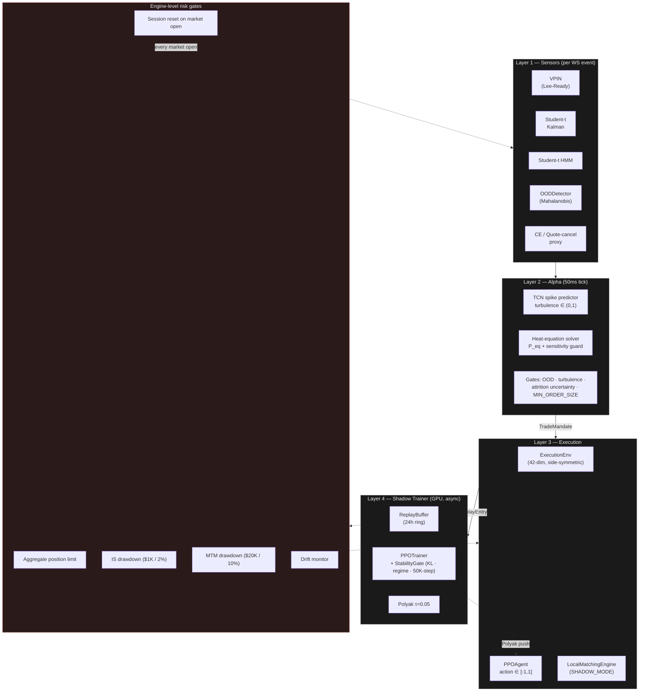

# Disruption Arbitrage Engine

> **Status (2026-05-12)**: Private research prototype. **L2 investigation
> formally closed** — the Path D feature set (CE ratio, OBI, MLOFI, VAMP,
> Kyle's λ) carries real directional signal (~55% paper accuracy at H=100
> ticks) but at magnitudes too small to overcome maker+taker execution
> costs: gross edge ≈ 0.06 bps per trade vs round-trip cost ≈ 5.5 bps.
> Full Phase A backtest in [LAYER2_TRAINING.md §14.7-§14.8](LAYER2_TRAINING.md).
> **Next research generation pivots to L3 (order-by-order) microstructure
> data** — queue depletion, cancellation velocity, order lifespan — which
> L2 snapshots aggregate away. Codebase preserved as the L2 reference
> baseline (anything L3 builds must beat F2=0.106 in-domain / max-prec
> 1.5× base / 0.06 bps gross directional edge). **Not production-ready** —
> `_live_submit` is a stub by design; the engine runs in shadow mode
> against simulated fills.


Physics-informed market microstructure research engine. Originally built
as a shock-arbitrage system: detect pre-shock signatures via L2-aggregate
features (a 5-channel TCN over a 60-tick rolling window), compute a
post-shock equilibrium price via attrition-adjusted heat-equation
diffusion, execute the resulting mandate through a fee-aware PPO agent.
After exhaustive L2 investigation (§13: eight refinement strategies;
§14: directional reframe), the L2-feature thesis is closed — signal
exists but magnitude is too small for any reasonable execution
framework. The architecture pivots to L3 microstructure for the next
generation; the L2 codebase is preserved as the calibrated baseline.

## Architecture at a glance



(Full topology with WebSocket sources, calibration loops, and per-task
asyncio cadences in [IMPLEMENTATION.md §1](IMPLEMENTATION.md).)

**Primary target: US equities via Alpaca** (NVDA by default; SPY also
supported). The original crypto path (Coinbase Advanced spot, optional
Binance liquidation feed) is retained behind the same interfaces and
selected automatically when `SYMBOL` contains a `/`.

For the full design rationale, see `IMPLEMENTATION.md`.

## Quickstart (US equities — same-day TCN training)

```powershell
# 1. Create a venv
python -m venv .venv
.\.venv\Scripts\Activate.ps1

# 2. Install dependencies (CPU torch). alpaca-py is in requirements.txt.
pip install -r requirements.txt

# 3. (Optional) Install CUDA torch for the shadow trainer
pip install torch --index-url https://download.pytorch.org/whl/cu121

# 4. Run the test suite
pytest

# 5. Set Alpaca paper credentials
$env:EXCHANGE_API_KEY = "<paper-key>"
$env:EXCHANGE_SECRET  = "<paper-secret>"
$env:SYMBOL = "NVDA"

# 6. Harvest 14 trading days of NVDA quotes + trades into a feature_history
#    CSV that is byte-identical to what the live FeatureDumper writes. This
#    drives the actual SensorArray code path on historical Alpaca data so
#    you can train the TCN today instead of waiting for live capture.
python fetch_history_alpaca.py --symbol NVDA --days 14

# 7. Verify enough shock events were captured, fit OOD, train the TCN.
#    Use train_tcn.py for harvests that fit in RAM, train_stream.py for
#    multi-GB streams (also auto-tunes the engine threshold from a sweep).
python check_shocks.py
python fit_ood_from_csv.py
python train_tcn.py        # or: python train_stream.py

# 8. Live shadow-mode smoke test (during market hours).
python engine.py
```

## Quickstart (crypto — original Coinbase path)

```powershell
$env:EXCHANGE_ID     = "coinbaseadvanced"
$env:SYMBOL          = "BTC/USD"
$env:EXCHANGE_API_KEY = "..."
$env:EXCHANGE_SECRET  = "..."
python engine.py
```

The presence of `/` in `SYMBOL` switches the engine to the ccxt.pro path
and re-enables the Binance liquidation feed if `EXCHANGE_ID=binance`.

## Critical environment variables

| Variable                     | Purpose                                                                                       |
| ---------------------------- | --------------------------------------------------------------------------------------------- |
| `EXCHANGE_ID`                | `alpaca` (default), `coinbaseadvanced`, `binance`. Auto-selected by `SYMBOL` shape if unset.  |
| `SYMBOL`                     | Equity ticker (e.g. `NVDA`, `SPY`) or crypto pair (e.g. `BTC/USD`). Default `NVDA`.           |
| `ALPACA_DATA_FEED`           | `iex` (free, default) or `sip` (Algo Trader Plus). Equities only.                             |
| `EXCHANGE_API_KEY`           | Alpaca paper/live API key, or Coinbase CDP key name. Disable withdrawal scopes.               |
| `EXCHANGE_SECRET`            | Matching secret. Stored in env, never on disk.                                                |
| `EXCHANGE_LIVE`              | Set to literal `"true"` to disable paper / sandbox.                                           |
| `LOG_LEVEL`                  | `DEBUG`, `INFO` (default), `WARNING`.                                                         |
| `REPLAY_CSV`                 | Path to a `feature_history_*.csv` for off-market replay smoke testing. When set, the engine swaps `SensorArray` for `ReplaySensorArray` (test_replay.py), skips Alpaca init, and skips the market-hours gate. Unset → live Alpaca feed. See "Replay smoke testing" below. |
| `REPLAY_TICK_SECONDS`        | Per-row sleep in replay mode. Default `0.05` (matches engine's 50ms tick). Lower for faster fast-forward.                                  |
| `MAX_SESSION_DRAWDOWN_USD`   | Absolute USD cap on IS-based session drawdown. Default `1000.0`.                              |
| `MAX_SESSION_DRAWDOWN_PCT`   | Percentage cap on IS-based drawdown, active only when peak ≥ `DRAWDOWN_PCT_MIN_PEAK_USD`. Default `0.02` (2%).        |
| `DRAWDOWN_PCT_MIN_PEAK_USD`  | Floor below which the percentage gate is skipped (avoids the unbounded-leverage formula on tiny peaks). Default `100.0`. |
| `MAX_MTM_DRAWDOWN_USD`       | Absolute USD cap on mark-to-market drawdown. Live default `20000.0`; replay default `1000000.0` (CSV session-boundary jumps would otherwise trip the live cap).               |
| `MAX_MTM_DRAWDOWN_PCT`       | Percentage cap on MTM drawdown. Live default `0.10` (10%); replay default `10.0` (effectively disabled).         |
| `MAX_POSITION_LIMIT`         | Per-symbol aggregate position cap. Default loaded from `_PAIR_DEFAULTS` (TSLA: 100, NVDA: 200, SPY: 500, BTC/USD: 0.5, etc.).                            |

## Operational toggles in `config.py`

| Flag                       | Default | Purpose                                                       |
| -------------------------- | ------- | ------------------------------------------------------------- |
| `SHADOW_MODE`              | `True`  | Route orders to `LocalMatchingEngine` (paper).                |
| `TRADING_ENABLED`          | `True`  | Global kill switch. Set `False` from outside to halt.         |
| `CALIBRATION_STALE`        | `False` | Set `True` by drift monitor; suspends mandates.               |
| `IS_EQUITY`                | derived | Auto-set from `SYMBOL`. Drives every code-path branch.        |
| `SESSION_WARMUP_SECONDS`   | `30`    | OOD gate quarantined for N seconds after each market open.    |
| `SESSION_RESET_HMM/_KALMAN/_VPIN` | `True` | Whether each filter is reset at every session open.           |

## Market session handling (equities only)

The engine pulls the trading calendar (including half-days and holidays)
from Alpaca's `/v2/calendar` endpoint, refreshed daily. When the market
closes:

1. Open orders are cancelled.
2. The strategy loop awaits the next session open.
3. On the next open, `SensorArray.reset_session()` re-initializes the HMM
   forward variable to a uniform prior, re-initializes the Kalman state,
   clears the VPIN buckets, and resets the C/E proxy.
4. The OOD gate is suspended for `SESSION_WARMUP_SECONDS` so the first
   morning quotes don't trip a false-positive shock signal while filters
   re-warm.

This avoids feeding the overnight gap to the Kalman as a 1-tick spread
innovation or scoring the first morning observation against yesterday's
regime distribution — both of which would otherwise produce an OOD storm
at the open.

Crypto runs 24/7; the `SessionManager` is not instantiated for crypto
symbols.

## Calibration workflow (equities, same-day path)

```powershell
# 1. Harvest history. Replays trades + quotes through the live SensorArray
#    code path so the CSV is byte-identical to live FeatureDumper output.
python fetch_history_alpaca.py --symbol NVDA --days 14

# 2. Verify shock count.
python check_shocks.py

# 3. Fit OOD distribution; writes calibration/latest_NVDA.json.
python fit_ood_from_csv.py

# 4a. Train the TCN — in-memory path, fine for harvests up to ~1 GB.
#     Writes calibration/tcn_weights_NVDA.pt + tcn_threshold_NVDA.json.
python train_tcn.py

# 4b. ...or use the streaming trainer for multi-GB harvests. Same outputs;
#     also runs a post-train threshold sweep and writes the full
#     precision/recall/F1 curve to tcn_threshold_sweep_NVDA.csv.
python train_stream.py
```

`train_stream.py` differs from `train_tcn.py` in three ways: (1) it
streams the CSV in polars batches via an `IterableDataset` instead of
loading it into RAM, (2) it builds positive labels directly from the
`regime` column when present (denser and more reliable than re-running
`identify_shock_events` on a curated/discontinuous file), and (3) it
auto-tunes the engine's operating threshold from a precision/recall
sweep instead of saving the placeholder `config.TURBULENCE_THRESHOLD`.

The crypto pipeline (online L2 capture, `identify_shock_events()`, EWLS
fit for `ALPHA_CALIBRATION_C`) is unchanged and documented in
`IMPLEMENTATION.md` §4.

## Threshold tuning

The engine reads `tcn_threshold_<SYMBOL>.json["threshold"]` at startup as
the boundary between "fire a mandate" and "stay quiet". `train_stream.py`
picks that value from a sweep over the trained model's prediction
distribution — by default with F-β where β=2 (recall-biased, on the
premise that a missed shock costs more than a wasted mandate).

```powershell
# Re-pick the threshold from existing weights — no retraining (~30s).
python train_stream.py --tune-only

# Switch criteria without retraining:
python train_stream.py --tune-only --threshold-criterion f1
python train_stream.py --tune-only --threshold-criterion min-precision --min-precision 0.75
python train_stream.py --tune-only --threshold-criterion min-recall --min-recall 0.70
python train_stream.py --tune-only --threshold-criterion fbeta --beta 3.0
```

Available criteria: `f1`, `fbeta` (default, with `--beta 2.0`),
`min-precision` (highest recall meeting the precision floor), and
`min-recall` (highest precision meeting the recall floor). The chosen
threshold + the underlying prec/rec/F1 are persisted as metadata in the
JSON; the full sweep table is dumped to
`calibration/tcn_threshold_sweep_<SYMBOL>.csv` for plotting.

### Held-out and cross-symbol evaluation

Pointing `--val-csv` at a different CSV runs the threshold sweep on it
instead of on the training data. Saves go to
`tcn_threshold_eval_<val_stem>.json` and
`tcn_threshold_sweep_eval_<val_stem>.csv` so the production threshold for
the current `SYMBOL` is never clobbered by a diagnostic run.

```powershell
# Temporal hold-out (different week, same symbol).
python train_stream.py --tune-only --val-csv calibration/feature_history_NVDA_holdout.csv

# Cross-symbol generalization (NVDA-trained → PLTR raw harvest).
python train_stream.py --tune-only --val-csv calibration/feature_history_PLTR.csv
```

Cross-symbol F1 will be materially lower than train-set F1 — that's
expected. Per-symbol calibration is the operational answer; the
cross-symbol number quantifies how much of the shock signature is
microstructure-universal vs ticker-specific.

## Datasets and empirical findings

Quick inventory of what's been harvested through `fetch_history_alpaca.py`
and what the model can and can't train on. Full discussion — including
the two distinct "loss not improving" failure modes, observed positive-
class density thresholds, per-symbol training results, cross-symbol
generalization tables, and IEX-feed sparsity by symbol — lives in
[`LAYER2_TRAINING.md`](LAYER2_TRAINING.md).

| Symbol | Source | Sessions | Rows | Pos rate after H=30 | Trainable directly? |
|---|---|---|---|---|---|
| NVDA balanced | curated subset of Alpaca IEX | – | 384,354 | 4.43% | yes |
| TSLA raw | Alpaca IEX | 73 | 46,973,402 | 0.98% | yes |
| PLTR raw | Alpaca IEX | ~14 | 9,365,123 | ~0.045% | no — held-out eval only |
| SPY raw | Alpaca IEX | 46 | 119,030,669 | ~0.015% | no — class collapse |
| BTC/USD, SOL/USD | Coinbase Advanced (legacy) | – | <250K each | – | regression-test only |

Empirical observation: this architecture trains cleanly above ~1%
positive-class density and class-collapses below ~0.02%. SPY on the
free-tier IEX feed sits in the dead zone because IEX captures only a
small fraction of SPY's flow (which is dominated by NYSE Arca + dark
ETF arbitrage venues); IEX is *not* sparsity-limited for actively-
traded single names like NVDA and TSLA. Implication for symbol
selection on this feed: prioritize venue overlap with IEX over
absolute notional volume.

### L2 closure (2026-05-12)

The two-week §13 investigation tested eight refinement strategies
(loss function, architecture, features, label window, dimensionless
features, vol-scaled labels, hybrid trigger, per-symbol training)
against the shock-prediction baseline of F2 = 0.121. None lifted
the ceiling above F2 ≈ 0.10-0.11 in-domain with proper temporal
holdout. §14 pivoted to directional prediction (`mid[t+H] > mid[t]`)
and found a real signal — 55% paper accuracy at H=100, +10pp over
random walk — but the Phase A backtest (`backtest_directional.py`)
showed the *magnitude* of the predicted moves is too small to clear
the round-trip execution cost: 0.06 bps gross edge vs 5.5 bps fee
bill, even under the most permissive (zero-adverse-selection) fill
model. Retraining at H=500 destroys the edge entirely (microstructure
signal decays past ~100 ticks). The L2 feature set carries genuine
but magnitude-insufficient predictive information. Path forward is
L3 (order-by-order) data, where the queue dynamics that L2
aggregates destroy may survive at tradeable magnitude. Detailed
write-up: [LAYER2_TRAINING.md §14.7-§14.8](LAYER2_TRAINING.md).

## File layout

```
disruption_arbitrage_engine/
├── engine.py                 # asyncio orchestrator, session manager, kill switches
├── layer1_sensors.py         # VPIN (Lee-Ready), Kalman, HMM, OOD,
│                             #   CEInferenceEngine (crypto L2),
│                             #   QuoteCancellationProxy (equities L1)
├── layer2_alpha.py           # TCN, heat solver, AlphaEngine
├── layer3_execution.py       # ExecutionEnv, PPOAgent, PPOTrainer
├── layer4_shadow.py          # ShadowSimulator, stability gate, Polyak update
├── matching_engine.py        # LocalMatchingEngine — paper fills
├── calibration.py            # shock identification, EWLS, drift monitor, OOD fit
├── fetch_history_alpaca.py   # historical harvester for the equities path
├── train_tcn.py              # supervised TCN training (in-memory)
├── train_stream.py           # streaming TCN trainer + threshold sweep
├── check_shocks.py           # validates feature_history shock density
├── fit_ood_from_csv.py       # offline OOD μ, Σ fit from feature_history
├── hpo.py                    # Optuna HPO over reward weights
├── synthetic_data.py         # synthetic feature_history generator
├── config.py                 # all hyperparameters + CALIBRATION_REGISTRY
├── requirements.txt
├── README.md                 # this file
├── IMPLEMENTATION.md         # full architectural rationale and runbooks
├── LAYER2_TRAINING.md        # TCN training research log: data, densities, results
└── tests/  (top-level test_*.py files, not a package)
    ├── test_features.py           # feature predictability diagnostic (KS-test
    │                              #   pre-shock vs random windows; tells you
    │                              #   whether the signal is in the data before
    │                              #   chasing label/loss/data-volume tweaks)
    ├── inspect_hl_liquidations.py # diagnostic: scan HL trade archive for
    │                              #   `dir` values, identify the liquidation
    │                              #   marker before wiring a venue adapter
    ├── test_sensors.py            # layer1 unit tests
    ├── test_calibration.py        # calibration helpers
    ├── test_matching_engine.py    # LocalMatchingEngine + structural isolation
    ├── test_alpha.py              # AlphaEngine mandate gates
    ├── test_execution.py          # ExecutionEnv + PPO contract
    ├── test_engine.py             # Engine risk gates: drawdown (IS+MTM), position limit, session reset
    └── test_replay.py             # ReplaySensorArray shim + replay-mode pytest cases
```

## Safety constraints

The engine has five independent risk gates plus structural isolation. Each
trips trading, and each is unit-tested:

- **Structural**: `matching_engine.py` cannot place real orders — import-time
  assertion. API keys must have **withdrawals disabled**. `EXCHANGE_LIVE=true`
  is required to leave paper.
- **OOD gate**: `OODDetector` blocks mandates when the live observation lies
  outside the calibrated training manifold by Mahalanobis distance > 4.5.
  Calibration is loaded from `calibration/latest_<SYMBOL>.json` at boot;
  cold-start prior used as fallback (regenerate via
  `fit_ood_from_csv.py`).
- **Aggregate position limit**: `MAX_POSITION_LIMIT` is enforced both
  per-mandate (in `AlphaEngine`) AND aggregate (`engine._would_exceed_position_limit`).
  Mandates that would push position further past the cap in the same direction
  are suppressed and logged as `MANDATE_SUPPRESSED_POSITION_LIMIT`.
- **Hybrid drawdown gate**: trips trading when EITHER
  - the IS-based drawdown (accumulated execution-shortfall costs)
    exceeds `MAX_SESSION_DRAWDOWN_USD` ($1K default), OR exceeds
    `MAX_SESSION_DRAWDOWN_PCT` (2%) once peak ≥ `DRAWDOWN_PCT_MIN_PEAK_USD` ($100), OR
  - the MTM-based drawdown (mark-to-market on `cash + position·mid`) exceeds
    `MAX_MTM_DRAWDOWN_USD` ($20K live / $1M replay), OR exceeds
    `MAX_MTM_DRAWDOWN_PCT` (10% live / 1000% replay) above the same floor.

  The kill-switch log line reports which gate(s) tripped and the underlying
  values for forensics.
- **Calibration drift**: rolling MAPE > 0.35 → strategy loop self-suspends
  until offline recalibration produces a fresh `latest_<SYMBOL>.json`.
- **Session boundary**: equities only — no mandates fire while the market is
  closed; on every detected close→open transition, both `SensorArray` state
  (HMM, Kalman, VPIN, CE) AND engine risk state (position, cash, PnL peaks)
  are reset to prevent overnight-gap drift and stale-peak gate trips.

## Replay smoke testing

When markets are closed (or for off-market verification), the engine can be
driven from a harvested `feature_history_*.csv` via the replay shim. This
exercises Layers 2/3/4 + dashboard end-to-end against historical data without
touching Alpaca:

```powershell
$env:SYMBOL = "TSLA"
$env:REPLAY_CSV = "calibration/feature_history_TSLA_balanced.csv"
python -u engine.py 2>&1 | Tee-Object -FilePath replay_smoke.log
```

How it works:

- `engine.py` checks `config.REPLAY_CSV` at boot. If non-empty, it skips
  Alpaca init, skips `SessionManager` (no market-hours gate), and instantiates
  `ReplaySensorArray` from `test_replay.py` instead of `SensorArray`.
- `ReplaySensorArray` streams the CSV in polars batches and yields one
  `PhysicsState` per row. The CSV's pre-computed `mahal_dist` is **ignored**;
  instead the live calibrated `OODDetector` is invoked to recompute distance
  against the loaded μ/Σ. Other features (ce_ratio, obi, vpin, regime) pass
  through unchanged.
- Order book snapshots are synthesized 1-level with depth skewed by OBI so
  the heat solver's shock-volume calculation `Q = |bid_total - ask_total|`
  reflects the harvested OBI signal. `LocalMatchingEngine` walks only
  top-of-book for cross detection, so 1 level suffices for fills.
- Risk-gate defaults loosen automatically in replay mode (`MAX_MTM_DRAWDOWN_USD`
  $20K → $1M) to absorb CSV session-boundary mid jumps. Production caps return
  the moment `REPLAY_CSV` is unset — single-variable swap to live.

Returning to live mode for Monday RTH:

```powershell
Remove-Item Env:REPLAY_CSV
$env:SYMBOL = "TSLA"
python -u engine.py 2>&1 | Tee-Object -FilePath engine_smoke_TSLA.log
```

`test_replay.py` doubles as a pytest module (5 tests verifying the shim's
`PhysicsState` construction and OOD passthrough); replay logic and tests
co-locate in the same file.

## Required validation before going live

1. ≥ 30 historical shock events in the calibration set
   (`MIN_CALIBRATION_EVENTS` in config). For NVDA on IEX-only data, this
   typically requires 7–14 trading days; bump `--days` if `check_shocks.py`
   reports too few.
2. Drift monitor inactive.
3. ≥ 72 hours of `SHADOW_MODE=True` operation against live data
   (equities: this spans ~10 trading sessions).
4. HPO winning trial validated on the SUBSEQUENT week.

Only then flip `SHADOW_MODE=False` and `EXCHANGE_LIVE=true`.

## Open work / collaboration

The L2 chapter is closed. The dominant open frontier is the L3 pivot.
Three concrete pieces that someone clone-and-explore could pick up:

### 1. L3 (order-by-order) microstructure data pivot — the new frontier

L2 snapshot-based features (Path D: CE ratio, OBI, MLOFI, VAMP, Kyle's λ)
were exhaustively tested and shown to carry real but magnitude-insufficient
directional signal (see [LAYER2_TRAINING.md §14.7-§14.8](LAYER2_TRAINING.md)).
The architectural premise — that *snapshots of book state* contain enough
information to predict shocks or tradeable directional moves — is
empirically falsified at this venue/time-resolution combination. The
queue dynamics that *precede* book-state changes (order arrivals,
cancellations, modifications, hidden-order inference from price-improvement
events, order lifespan distributions) are aggregated away by L2 snapshots.

What L3 requires:

1. **Data source.** Hyperliquid's S3 archive is L2-only as far as
   verified; need (a) an L3-emitting venue with a public archive
   (Binance tick data, Coinbase Advanced order-by-order, Databento for
   futures), (b) live L3 capture forward from the WebSocket feed, or
   (c) reconstruction from delta-stream data if accessible.
2. **New sensor classes in `layer1_sensors.py`** that consume *order
   events*, not snapshots: per-side cancellation rate, order-lifespan
   distribution, queue-position evolution, hidden-order inference,
   trade-aggressor sequencing. Path G's `BOUNDARY_CONDITIONS.md`
   already noted that the discrete quantum of market data is the
   order-event, not the snapshot.
3. **Replacement TCN feature stack.** Path D's 5 channels become a
   small subset of the new stack; `TCN_INPUT_CHANNELS` likely grows
   to 10-20. Calibration and training infrastructure (`calibration.py`,
   `train_stream.py`, `backtest_directional.py`) carries over with
   schema extensions.
4. **L2 codebase frozen as reference baseline.** Anything L3 builds
   must beat F2=0.106 (in-domain, temporal val) and 0.06 bps gross
   directional edge per trade.

### 2. (Frozen, pending L3 architecture) Layer 3 PPO

The execution agent (`layer3_execution.py`) is structurally complete — full
`ExecutionEnv`, `PPOAgent` with split CNN encoders, `PPOTrainer` with GAE,
clipped surrogate, and entropy regularization — but it is **random-init at
every session start**, and the L2 mandate it was built to consume is no
longer the active alpha generator. Resuming PPO development is gated on
the L3 architecture defining a new mandate shape (likely continuous
inventory skew + confidence rather than discrete IS-targeted execution).

Specific open problem: a saved-and-loadable PPO checkpoint flow that
respects the regime-match assumption. Naive load-on-boot would push
yesterday-trained-on-Turbulent weights into a Laminar morning. The right
abstraction is regime-keyed checkpoints (load the weights matching today's
opening regime), but that requires a regime-classification step before the
TCN buffer warms up. Open design question.

### 3. Eval harness needs hooking

`hpo.py` defines the Optuna study over `(η, γ_inv, terminal_mult)` with
holdout validation, but the data-provider callables
(`train_data_provider`, `eval_data_provider`, `holdout_data_provider`) are
stubs (see `IMPLEMENTATION.md §9`). Producing a real archived-mandate
replay stream is a one-time write specific to whoever has the data lake —
not hard, just unwritten.

### 4. Replay session-boundary detection

`test_replay.ReplaySensorArray` doesn't notice when the harvested CSV
stitches across trading days; mid can jump 40%+ at a session join. Today
this is worked around by loosening the MTM drawdown caps in replay mode.
A timestamp-gap detector that triggers `_reset_session_risk_state` would
let the production caps work in replay too — small change, fully isolated
to `test_replay.py`.

These are described more deeply in [LAYER2_TRAINING.md §11](LAYER2_TRAINING.md);
that document is also the source of truth for what's been calibrated, what
the cross-symbol generalization looks like, and what claims this project
will and will not make.
